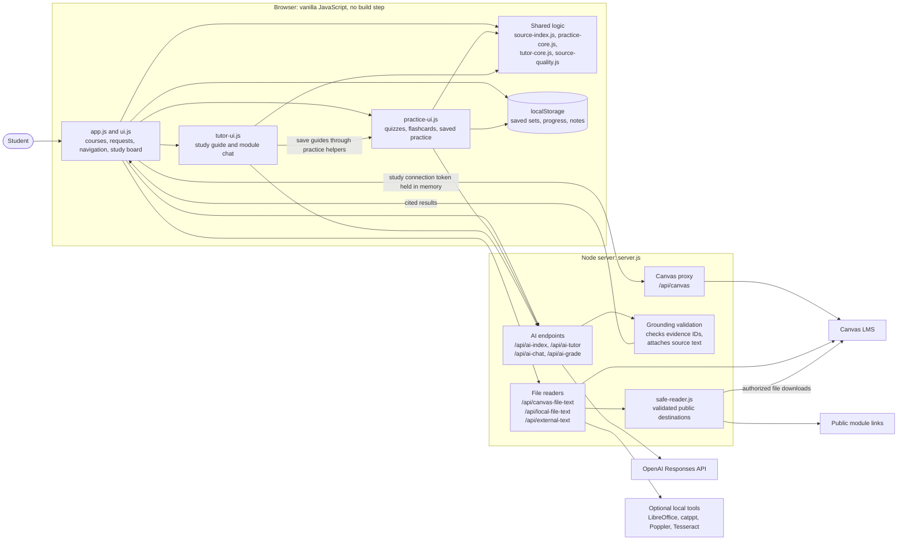
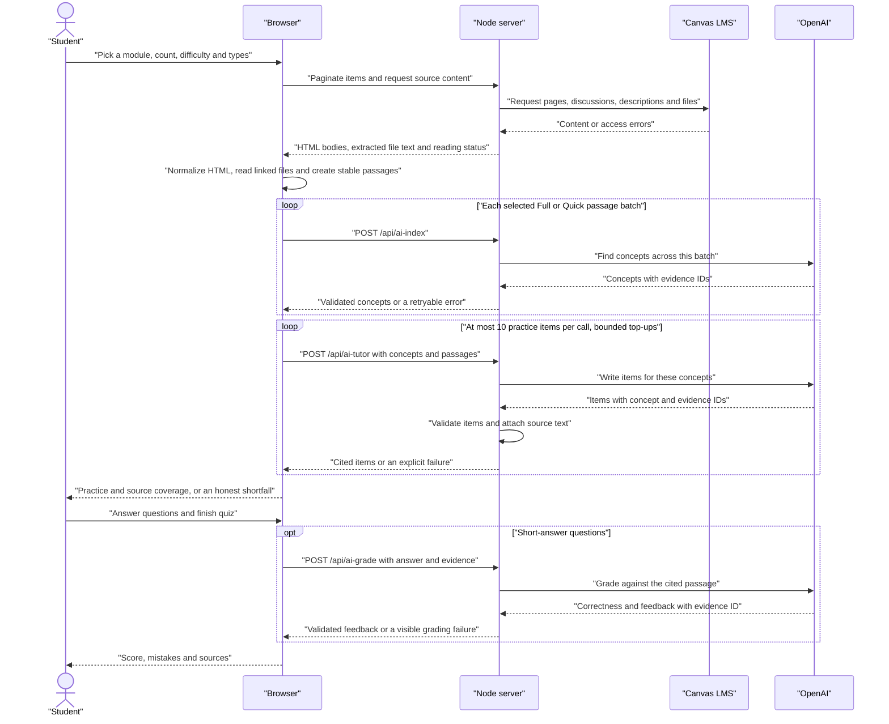
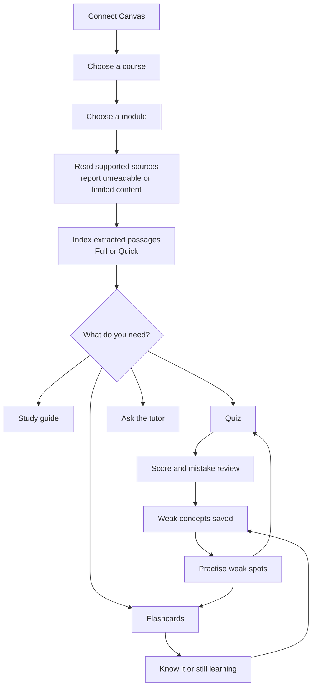

# Canvas Tutor

Canvas Tutor turns your Canvas LMS course files into study guides, quizzes and flashcards with answers cited to real source passages.


A personal local study app built with vanilla JavaScript and Node.js. It is not a production-ready multi-user service.

## Features

- **Read:** Canvas pages, discussions, assignments and files; follow linked course files; inspect reading limits and source coverage.
- **Practise:** Choose count, difficulty and question types; review scores and mistakes, flip flashcards, export CSV and revisit weak concepts.
- **Tutor:** Build cited study guides, ask module questions, choose hints or explanations, and ask for help on a card or quiz item.
- **Plan:** Track upcoming deadlines, plan assignments, set goals, save board notes and start a Focus Sprint.

## How it works

### System architecture



Browser controllers make requests; shared modules supply passage IDs, schemas, retrieval and review logic in the browser and Node. Canvas tokens authorize Canvas requests, while OpenAI credentials stay on the server; optional email storage is separate.

### From a module to a cited quiz



Readable text is indexed in batches across the module, with a disclosed Quick sampling option. Generation uses selected concepts and their evidence; it can return fewer items when validation or provider failures prevent a complete set.

### Study workflow



Saved sets and progress remain available after refresh; fresh Canvas reading requires reconnection. Chat and the extraction/index cache remain in session memory.

For citations, the model returns a passage ID instead of composing a quotation. The server attaches the real passage, filename and section, and drops items with unknown IDs. A valid citation does not prove the explanation is correct; see [architecture](docs/ARCHITECTURE.md) and [limitations](docs/LIMITATIONS.md).

## Quick start

Requirements: Node **22.13.0+**, npm, and a Canvas account permitted to create an access token. AI features require an OpenAI API key; saved practice and source reading work without one.

```bash
npm install
test -f .env || cp .env.example .env
npm run preview
```

Open [http://127.0.0.1:4177](http://127.0.0.1:4177). Preview disables email and drafts; normal `npm start` enables the existing scheduler. Use the Node URL, not `file://`; stop with Ctrl+C or use `npm run preview -- 4188` for another port.

In Canvas, open **Account → Settings → New Access Token**, if your school permits it. Create a token for this app and paste it only into the local connection form with your school URL; see the [Canvas token guide](https://community.instructure.com/en/kb/articles/662901-how-do-i-manage-api-access-tokens-in-my-user-account). A 401 stops retries; replace expired credentials privately, then reconnect.

Edit your private `.env` to set `OPENAI_API_KEY`, then restart the preview. Never commit the key. Connect, choose a course and module, inspect its sources, then index and generate practice or open the tutor.

## Configuration

| Setting | Default | Use |
| --- | --- | --- |
| `OPENAI_API_KEY` | Unset | Server-only AI credential. |
| `OPENAI_MODEL` | `gpt-5-mini` | Model for all AI tools. |
| `PORT` | `4177` | Local server port. |
| `EMAIL_DISABLED` | Preview forces `1` | Block mail and drafts during development. |
| `LIBREOFFICE_PATH` | Auto-detect | Office conversion executable. |
| `OCR_LANG` | `eng` | Installed Tesseract language data. |

See [all variables, reader limits and optional-tool installation](docs/CONFIGURATION.md). Restart after changing configuration; no multi-model picker is implemented.

## Supported file formats

| Format | Reader |
| --- | --- |
| PDF, including PDFs in ZIPs | PDF.js; optional OCR for pages without extracted text |
| DOCX | Document-body XML |
| PPTX | Slide text and linked speaker notes; optional OCR for slides without text |
| XLSX | Named worksheet XML, shared/inline strings, raw cell values and labelled formula caches |
| PPT, ODP | LibreOffice → PPTX; catppt remains a fallback for legacy PPT |
| DOC, RTF, ODT | LibreOffice → DOCX |
| XLS, ODS | LibreOffice → XLSX |
| IPYNB/PYNB | Markdown, code and raw cells |
| Text, Markdown, CSV, JSON, HTML, source code | Text extraction |
| PNG, JPEG, TIFF, BMP | Optional Tesseract OCR |
| ZIP | Supported document types above; no recursive ZIP expansion |

## Project structure

```text
index.html          Browser shell
styles.css          Responsive layout and styling
app.js              Canvas reading, requests and study board
ui.js               Navigation and course workspaces
server.js           Node APIs, file readers, AI and existing mail service
safe-reader.js      External destination and download checks
source-quality.js   Unusable-text filters
source-index.js     Stable passages, concepts and coverage
practice-core.js    Shared practice contracts and storage allowlists
practice-ui.js      Quiz, flashcard and saved-practice interfaces
tutor-core.js       Guide contracts and passage retrieval
tutor-ui.js         Study guides and module chat
tests/              Fixture and DOM regression tests
docs/               Architecture, configuration, email and limitations
.env.example        Configuration template; keep real .env private
package.json        Runtime requirements, dependencies and commands
render.yaml         Existing deployment blueprint
AGENTS.md           Project working rules
```

## Testing

```bash
npm test
npm run check
```

Tests cover mocked Canvas/OpenAI flows, reading, citations, batching, cancellation, typed quizzes, scoring, review, storage and chat. Installed-tool checks use local fixtures and may skip when tools are absent. They do not verify live Canvas permissions, live model quality, real OCR accuracy or visual browser behavior; [verification details](docs/LIMITATIONS.md) preserve those limits.

## Security and privacy

The study connection token stays in browser memory and is sent through the backend for authorized Canvas requests, never in localStorage or URLs. The OpenAI key stays in the server environment/private `.env`; AI requests send selected course text and use `store: false`.

Browser storage contains study sets, progress, notes, goals and preferences, including the Canvas URL and mail address/time. Optional mail scheduling stores a separate token server-side in ignored digest configuration; see [email credential storage](docs/EMAIL.md). External reading validates redirects, pins DNS, blocks private/reserved IPv4 and literal IPv6 destinations, and never forwards Canvas credentials to external sites.

## Limitations

- Citations verify real passages, not the correctness of every explanation, distractor or AI grade.
- OCR can misread code, tables and diagrams; partially textual pages may still need a better export.
- Complex Office layouts, charts, encrypted files, ZIP64 and unusual XML variants remain limited.
- Large modules cost more AI calls; indexing/retrieval can miss concepts, and Quick mode samples text.
- Browser storage is finite and origin-specific; extraction, indexing and chat do not survive refresh.
- This personal local app lacks the authentication, quotas and process isolation needed for public multi-user hosting.

Read the [full limitations and unverified areas](docs/LIMITATIONS.md).

## Roadmap

Shared rooms, study buddies and a multi-model picker are not implemented. The app labels the collaboration placeholders “Coming soon.”

## Daily Focus Mail

Optional Daily Focus Mail builds a Canvas To Do digest and five focus points.
Preview keeps email disabled; normal startup can run the saved scheduler.
See [email, Mac background setup, Render and GitHub Actions](docs/EMAIL.md).

## Tech stack and acknowledgements

Node.js, vanilla JavaScript, [PDF.js](https://mozilla.github.io/pdf.js/) and the OpenAI Responses API; jsdom supports DOM tests. Optional readers use LibreOffice, catdoc/catppt, Poppler and Tesseract. The binary PPT test fixture comes from Apache POI, with [provenance and license notices](tests/fixtures/README.md).

## License and author

No open-source license has been chosen yet. All rights reserved.

Author: [Sandeep Shah](https://github.com/sande231).
